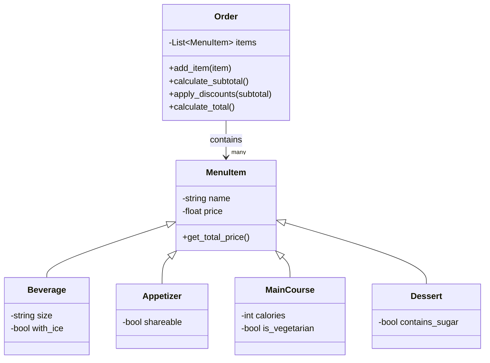

# POO-Reto-03
Solución del Reto #03 de la Asignatura Programación Orientada a Objetos - UNAL

## Ejercicio clase 7
Se implemento la clase rectangle:
- 3 métodos de inicialización
- Square heredando de Rectangle
- compute_area()
- compute_perimeter()
- compute_interference_point()
- Ejemplos de uso

**Codigo**

```python

class Point:
    def __init__(self, x, y):
        self.x = x
        self.y = y


class Rectangle:
    def __init__(self, p1=None, p2=None, center=None, width=None, height=None):
        # Method 1: Bottom-left corner(Point) + width and height
        if p1 and width and height:
            self.width = width
            self.height = height
            self.center = Point(p1.x + width/2, p1.y + height/2)

        # Method 2: Center(Point) + width and height
        elif center and width and height:
            self.width = width
            self.height = height
            self.center = center

        # Method 3: Two opposite corners (Points)
        elif p1 and p2:
            self.width = abs(p2.x - p1.x)
            self.height = abs(p2.y - p1.y)
            self.center = Point((p1.x + p2.x)/2, (p1.y + p2.y)/2)

    def compute_area(self):
        return self.width * self.height

    def compute_perimeter(self):
        return 2 * (self.width + self.height)

    def compute_interference_point(self, p):
        left   = self.center.x - self.width/2
        right  = self.center.x + self.width/2
        bottom = self.center.y - self.height/2
        top    = self.center.y + self.height/2

        return (left <= p.x <= right) and (bottom <= p.y <= top)


class Square(Rectangle):
    def __init__(self, p1=None, p2=None, center=None, side=None):

        if center and side:
            super().__init__(center=center, width=side, height=side)

        elif p1 and side:
            super().__init__(p1=p1, width=side, height=side)

        elif p1 and p2:
            side = abs(p2.x - p1.x)
            super().__init__(p1=p1, width=side, height=side)

# Rectangle
r1 = Rectangle(p1=Point(0, 0), width=4, height=2)
print("Area:", r1.compute_area())           
print("Perimeter:", r1.compute_perimeter()) 
print("Center:", (r1.center.x, r1.center.y))
p = Point(1, 1)
print("Inside: ", r1.compute_interference_point(p))

# Square
s2 = Square(center=Point(10, 10), side=4)
print("Perimeter:", s2.compute_perimeter())

```

## Reto 3: Ejercicio clase 8
Se implemento la clase linea:
- compute_length()
- compute_slope()
- compute_horizontal_cross()
- compute_vertical_cross()
- Ejemplos de uso

Se redefinió la clase rectangle:
- Metodo de inicializacion usando 4 lineas
- Ejemplos de uso

**Codigo**

```python
import math

class Point:
    def __init__(self, x, y):
        self.x = x
        self.y = y

class Line:
    def __init__(self, start, end):
        self.start = start
        self.end = end
        self.length = self.compute_length()
        self.slope = self.compute_slope()

    def compute_length(self):
        return math.sqrt((self.end.x - self.start.x)**2 +
                        (self.end.y - self.start.y)**2)

    def compute_slope(self):
        dx = (self.end.x - self.start.x)
        dy = (self.end.y - self.start.y)
        if dx == 0:
            return 90  # vertical line
        angle = math.degrees(math.atan(dy/dx))
        return angle

    def compute_horizontal_cross(self):
        return (self.start.y == 0 or self.end.y == 0 or
                (self.start.y < 0 < self.end.y) or
                (self.end.y < 0 < self.start.y))

    def compute_vertical_cross(self):
        return (self.start.x == 0 or self.end.x == 0 or
                (self.start.x < 0 < self.end.x) or
                (self.end.x < 0 < self.start.x))

class Rectangle:
    def __init__(self, line1, line2, line3, line4):
        self.lines = [line1, line2, line3, line4]

    def compute_perimeter(self):
        return sum(line.length for line in self.lines)

    def compute_area(self):
        side1 = self.lines[0].length
        side2 = self.lines[1].length
        return side1 * side2

# Line
p1 = Point(0, 0)
p2 = Point(3, 4)

line = Line(p1, p2)

print("Length:", line.length)
print("Slope:", line.slope)
print("intersection with x-axis?", line.compute_horizontal_cross())
print("intersection with y-axis?", line.compute_vertical_cross())

# Horizontal/Vertical lines
h = Line(Point(0, 2), Point(5, 2))
v = Line(Point(3, -1), Point(3, 4))

print(h.slope)
print(v.slope)

# Rectangle
A = Point(0, 0)
B = Point(4, 0)
C = Point(4, 3)
D = Point(0, 3)

l1 = Line(A, B)
l2 = Line(B, C)
l3 = Line(C, D)
l4 = Line(D, A)

rect = Rectangle(l1, l2, l3, l4)

print("Perimeter:", rect.compute_perimeter())
print("Area:", rect.compute_area())

```

## Reto 3: Restaurant scenario
Programa para calcular la cuenta del pedido de un cliente en un restaurante

**Codigo**

```python
class MenuItem:
    def __init__(self, name, price):
        self.name = name
        self.price = price

    def get_total_price(self):
        return self.price

class Beverage(MenuItem):
    def __init__(self, name, price, size, with_ice):
        super().__init__(name, price)
        self.size = size
        self.with_ice = with_ice

class Appetizer(MenuItem):
    def __init__(self, name, price, shareable):
        super().__init__(name, price)
        self.shareable = shareable

class MainCourse(MenuItem):
    def __init__(self, name, price, calories, is_vegetarian):
        super().__init__(name, price)
        self.calories = calories
        self.is_vegetarian = is_vegetarian

class Dessert(MenuItem):
    def __init__(self, name, price, contains_sugar):
        super().__init__(name, price)
        self.contains_sugar = contains_sugar

class Order:
    def __init__(self):
        self.items = []

    def add_item(self, item: MenuItem):
        self.items.append(item)

    def calculate_subtotal(self):
        return sum(item.get_total_price() for item in self.items)

    def apply_discounts(self, subtotal):
        discount = 0

        # Descuento 1: el total supera 50000
        if subtotal > 50000:
            discount += 0.10

        # Descuento 2: más de 3 items
        if len(self.items) >= 4:
            discount += 0.05

        # Descuento 3: al menos 1 bebida y 1 plato fuerte
        has_beverage = any(isinstance(i, Beverage) for i in self.items)
        has_main = any(isinstance(i, MainCourse) for i in self.items)
        if has_beverage and has_main:
            discount += 0.05

        return subtotal * (1 - discount)

    def calculate_total(self):
        subtotal = self.calculate_subtotal()
        return self.apply_discounts(subtotal)

menu = [
    Beverage("Coca-Cola", 5000, "350ml", True),
    Beverage("Limonada", 6000, "400ml", False),
    Beverage("Café", 4000, "250ml", False),

    Appetizer("Papas Fritas", 8000, True),
    Appetizer("Aros de Cebolla", 9000, True),

    MainCourse("Hamburguesa", 18000, 850, False),
    MainCourse("Pizza Personal", 20000, 1200, False),
    MainCourse("Ensalada Vegetariana", 15000, 400, True),

    Dessert("Helado", 7000, True),
    Dessert("Brownie", 9000, True)
]

order = Order()

order.add_item(menu[0])  # Coca-Cola
order.add_item(menu[3])  # Papas fritas
order.add_item(menu[5])  # Hamburguesa
order.add_item(menu[8])  # Helado
order.add_item(menu[9])  # Brownie
order.add_item(menu[9])  # Brownie

print("Subtotal:", order.calculate_subtotal())
print("Total con descuentos:", order.calculate_total())

```

**Diagrama**

[**Link del Diagrama**](https://mermaid.live/edit#pako:eNptU9tq4zAQ_RUxTymNgy8xTcRS6OWlsGXfF4OZ2FNHVJaMJLebZtNvX9lpXCdrPQhpjs45oxlpD4UuCTgUEq19FFgZrDPF_Ogj7JlU--SoZvtjtBuBdUaoiimsaRR9kRoda4woRtHrilzutEOZ98js6ogdMjW2uac3MljRlI0VH2ObjdaSvQu3zQejC7G7piHnSeZMrefZLRrCjZwmPqNQD7o19jwPoRwrUGojyF4KCpu_kb8jGoFqUvSRrCXj_s-l0Mp5Q5vbtkIzyf1lyotb_BTWfZ6a8smEn0c5XWNZ5l1s1k1XI8DnX7QSHXm3Td-P2RjGppG7vBS20K1ydnY6NC1xxh9SHp7Kj79BMHR0ChsaNAV-N2EK_armyfNYoCC4ZRnUqHYZfJ_nQ4UzBXOojCiBO9PSHGoyNXZb6GubgduSf8vA_bJE85pBpg6e06D6rXV9ohndVlvgLyit37VN6Yvx9WeGqCHlU3roygh8HfUawPfwB3iULhfrKIzTJA7DcBUtkznsgMfpYp3cpNFyFSdhul7GyWEOH71tuFjdpId_li8h-A)




